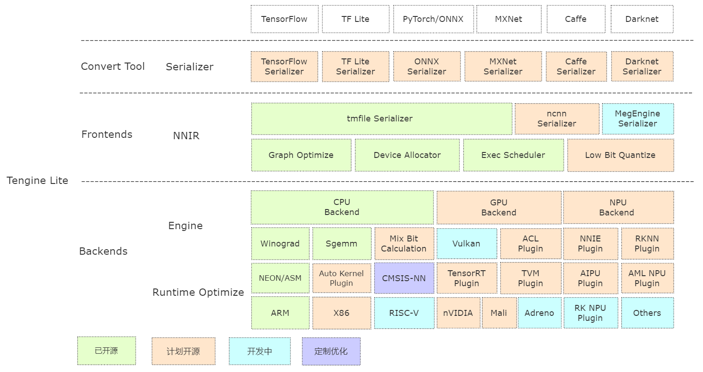

  
  <h3> <a href="https://tengine-docs.readthedocs.io/en/latest/"> Documentation </a> | <a href="https://tengine-docs.readthedocs.io/zh_CN/latest/"> 中文文档 </a>  </h3>

简体中文 | [English](./README_EN.md)

# Tengine

## 简介

**Tengine** 由 **[OPEN AI LAB](http://www.openailab.com)** 主导开发，该项目实现了深度学习神经网络模型在嵌入式设备上的**快速**、**高效**部署需求。为实现在众多 **AIoT** 应用中的跨平台部署，本项目使用 **C 语言**进行核心模块开发，针对嵌入式设备资源有限的特点进行了深度框架裁剪。同时采用了完全分离的前后端设计，有利于 CPU、GPU、NPU 等异构计算单元的快速移植和部署，降低评估、迁移成本。

Tengine 核心代码由 4 个模块组成：

- [**device**](source/device)：NN Operators 后端模块，当前提供 CPU 代码，后续逐步开源 GPU、NPU 参考代码；
- [**scheduler**](source/scheduler)：框架核心部件，包括 NNIR、计算图、硬件资源、模型解析器的调度和执行模块；
- [**operator**](source/operator)：NN Operators 前端模块，实现 NN Operators 注册、初始化；
- [**serializer**](source/serializer)：模型解析器，实现 tmfile 格式的网络模型参数解析。

## 架构简析

## 快速上手

### 编译

- [快速编译](doc/compile.md) 基于 cmake 实现简单的跨平台编译。

### 示例

- [examples](examples/) 提供基础的分类、检测算法用例，根据 issue 需求持续更新。

### 模型仓库

- [百度网盘](https://pan.baidu.com/s/1JsitkY6FVV87Kao6h5yAmg) （提取码：7ke5）

- [Google Drive](https://drive.google.com/drive/folders/1hunePCa0x_R-Txv7kWqgx02uTCH3QWdS?usp=sharing)

### 转换工具

- [预编译版本](https://github.com/OAID/Tengine/releases/download/lite-v1.2/convert_tool.zip)：提供 Ubuntu 18.04 系统上预编译好的模型转换工具；
- [在线转换版本](https://convertmodel.com/#outputFormat=tengine)：基于 WebAssembly 实现（浏览器本地转换，模型不会上传）；
- [源码编译](https://github.com/OAID/Tengine-Convert-Tools)：参考 **Tengine-Convert-Tools** 项目编译生成，建议采用。

### 量化工具

- [预编译版本](tools/quantize/README.md)：提供 Ubuntu 18.04 系统上预编译好的模型量化工具，已支持uint8/int8。

### 速度评估

- [Benchmark](benchmark/) 基础网络速度评估工具，欢迎大家更新。

### NPU Plugin

- [TIM-VX](doc/npu_tim-vx_user_manual.md) VeriSilicon NPU 使用指南。

### AutoKernel Plugin
- [AutoKernel](https://github.com/OAID/AutoKernel.git) 是一个简单易用，低门槛的自动算子优化工具，AutoKernel Plugin实现了自动优化算子一键部署到Tengine中。

## Roadmap

- [Road map](doc/roadmap.md)

## 致谢

Tengine Lite 参考和借鉴了下列项目：

- [Caffe](https://github.com/BVLC/caffe)
- [Tensorflow](https://github.com/tensorflow/tensorflow)
- [MegEngine](https://github.com/MegEngine/MegEngine)
- [ONNX](https://github.com/onnx/onnx)
- [ncnn](https://github.com/Tencent/ncnn)
- [FeatherCNN](https://github.com/Tencent/FeatherCNN)
- [MNN](https://github.com/alibaba/MNN)
- [Paddle Lite](https://github.com/PaddlePaddle/Paddle-Lite)
- [ACL](https://github.com/ARM-software/ComputeLibrary)
- [stb](https://github.com/nothings/stb)
- [convertmodel](https://convertmodel.com)
- [TIM-VX](https://github.com/VeriSilicon/TIM-VX)

## License

- [Apache 2.0](LICENSE)

## FAQ

- [FAQ 常见问题](doc/faq.md)

## 技术讨论

- Github issues
- QQ 群: 829565581
- Email: Support@openailab.com
- Tengine 社区: http://www.tengine.org.cn
