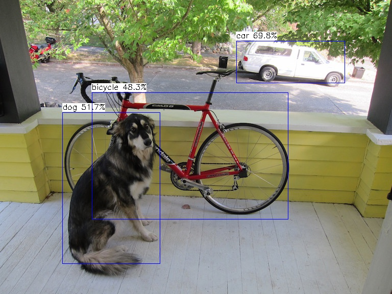

# Tengine Lite with Opensource DeepLearning Accelerator

## 1. 简介

opendla是基于英伟达开源的加速器NVDLA，之所以后端的名称叫opendla是因为英伟达官方的仓库已经停止维护两年了，而显然NVDLA还有许多可以改进的空间，改进之后的加速器需要和原来的NVDLA作区分，索性就直接叫opendla了，暂时在 [ZYNQ-NVDLA](https://github.com/LeiWang1999/ZYNQ-NVDLA) 这个仓库维护。

现在的后端，只对接了 NVDLA 的 small 配置，有如下特点：

1. ZYNQ 7045 | XCZU9EG-2 可以跑到 100 Mhz
2. 8\*8 的 PE 阵列
3. 没有 Global SRAM 缓存
4. 没有查找表电路
5. 没有RUBIK数据重排引擎
6. 目前支持的算子有：Conv｜Relu｜Min/Max/Avg Pooling｜FullyConntected｜ElementWise 其它会切给CPU运行

## 2. 如何编译
### 2.1 依赖项
依赖项有三部分：
> 第一部分是 芯片对应的 opendla.ko 程序，在 [这篇文章](https://zhuanlan.zhihu.com/p/378202360) 里有介绍如何编译，目前 [仓库](https://github.com/LeiWang1999/ZYNQ-NVDLA) 里放置的版本是针对Linux 4.13内核的，如果是别的内核版本需要更改一些函数；
> 第二部分是 NVDLA 的依赖库，包括libjpeg与libprotobuf，如果是aarch64架构可以直接使用预编译好的文件。
> 第三部分是 NVDLA 原来支持的 Compiler 和 Runtime，需要编译出链接库放到lib目录下，如果是aarch64架构可以直接使用预编译好的文件。

### 2.2 编译过程
为了方便理解全流程的过程，首先描述编译的完整过程的流程。

为了编译Tengine的opendla后端支持代码，首先需要编译 libcompiler.so 与 libruntime.so，而 libcompiler 依赖 libprotobuf (版本为2.6.1)，libruntime 依赖 libjpeg (版本为libjpeg6b)。

### 2.3 拉取代码
首先，**这里演示的整个编译的过程都在开发板卡上运行**，否则需要交叉编译；例子都是以root的身份来运行的；如何使用开发板连网可以参考 [这篇文章](https://zhuanlan.zhihu.com/p/378814739) 。

#### 2.3.1 拉取 ZYNQ-NVDLA

```bash 
$ git clone https://github.com/LeiWang1999/ZYNQ-NVDLA # clone不下来的话就本地下载用sftp传上去吧:D
```

#### 2.3.2 拉取 Tengine-Lite
```bash
$ git clone https://github.com/OAID/Tengine.git Tengine
```

### 2.4 Tengine-Lite 集成编译 opendla 
Tengine-Lite 目前只支持一种 opendla 的集成编译方法，即编译opendla的软件支持，首先生成.so文件，而在Tengine编译opendla后端的时候进行链接。

其他的方案，例如在Tengine编译的过程中连同opendla的编译器和运行时的源代码一起编译，由于代码肯定是要重构的，所以现在还不支持。

这里不将内核驱动程序`opendla.ko`是如何编译的，如何在Petalinux里编译看这篇 [文章](https://zhuanlan.zhihu.com/p/378202360) 。

如果是 aarch64 的架构，可以直接使用 [prebuilt](https://github.com/LeiWang1999/ZYNQ-NVDLA/tree/master/prebuilt/lib/aarch64-ubuntu) 的lib。

#### 2.4.0 载入内核驱动程序

```bash
$ insmod /lib/modules/4.19.0-xilinx-v2019.1/extra/opendla.ko
```

使用dmesg查看内核日志:

```bash
$ dmesg | tail
[   12.817877] macb ff0e0000.ethernet eth0: link up (1000/Full)
[   12.817900] IPv6: ADDRCONF(NETDEV_CHANGE): eth0: link becomes ready
[   20.661453] opendla: loading out-of-tree module taints kernel.
[   20.664248] Probe NVDLA config nvidia,nv_small
[   20.669152] 0 . 12 . 5
[   20.669155] reset engine done
[   20.671257] [drm] Initialized nvdla 0.0.0 20171017 for a0000000.NV_nvdla_wrapper on minor 1
```

查看是否注册了nvdla的中断以及nvdla驱动所需的设备`renderD128`是否存在来确定是否真的安装完成驱动了:

```bash
root@arm:~# insmod /lib/modules/4.19.0-xilinx-v2019.1/extra/opendla.ko 
root@arm:~# cat /proc/interrupts | grep nvdla
 45:          0          0     GIC-0  61 Level     40000000.NV_nvdla_wrapper
root@arm:~# ls /dev/dri/
card0  renderD128
```

#### 2.4.1 编译libjpeg6b

如果是aarch64，跳过该步骤即可，直接使用仓库里的libjpeg.a.

``` bash
$ wget http://www.ijg.org/files/jpegsrc.v6b.tar.gz
$ tar -xzvf jpegsrc.v6b.tar.gz
$ cd jpeg-6b/
$ ./configure
$ make -j `nproc`
$ make install
$ cp /usr/local/lib/libjpeg.a ~/ZYNQ-NVDLA/umd/external/ 
```

#### 2.4.2 编译libprotobuf.a

```bash
$ cd ~/ZYNQ-NVDLA/umd/external/protobuf-2.6/
$ apt-get install -y autoconf automake libtool
$ autoscan & aclocal & autoconf
$ automake --add-missing
$ ./configure
$ make -j `nproc`
$ make install
$ cp /usr/local/lib/libprotobuf.a ~/ZYNQ-NVDLA/umd/apps/compiler/
$ cp /usr/local/lib/libprotobuf.a ~/ZYNQ-NVDLA/umd/core/src/compiler/
```

#### 2.4.3 编译 Compiler 与 Runtime
```bash
$ cd ~/ZYNQ-NVDLA/umd/
$ make -j `nproc` TOP=${PWD} TOOLCHAIN_PREFIX=/usr/bin/ compiler
$ make -j `nproc` TOP=${PWD} TOOLCHAIN_PREFIX=/usr/bin/ runtime
```
这样在out目录下就会生成所需的lib，将lib和include拷贝到Tengine目录下：

```bash
$ cp ~/ZYNQ-NVDLA/include -r ~/Tengine/source/device/opendla
$ cp ~/ZYNQ-NVDLA/umd/out/core/src/compiler/libnvdla_compiler/libnvdla_compiler.so -r ~/Tengine/source/device/opendla/lib/
$ cp ~/ZYNQ-NVDLA/umd/out/core/src/runtime/libnvdla_runtime/libnvdla_runtime.so -r ~/Tengine/source/device/opendla/lib/
$ cp /usr/local/lib/libprotobuf.a ~/Tengine/source/device/opendla/lib/
```

#### 2.4.4 编译 Tengine

```bash
$ cd ~/Tengine
$ mkdir build & cd build
$ cmake .. -DTENGINE_ENABLE_OPENDLA=ON
```

## 3. Demo

#### 3.1 Classification

**Resnet18-Cifar10**

```bash
$ cd <tengine-lite-root-dir>/build
$ cmake --build . --target tm_classification_opendla
$ cd examples
$ ./tm_classification_opendla -m /root/Tengine/models/resnet18-cifar10-nosoftmax-relu_int8.tmfile -i /root/Tengine/images/cat.jpg -g 32,32 -s 1,1,1
Mean value not specified, use default   104.0, 116.7, 122.7
tengine-lite library version: 1.4-dev
NVDLA time: 0.012502 seconds

model file : /root/Tengine/models/resnet18-cifar10-nosoftmax-relu_int8.tmfile
image file : /root/Tengine/images/cat.jpg
img_h, img_w, scale[3], mean[3] : 32 32 , 1.000 1.000 1.000, 104.0 116.7 122.7
Repeat 1 times, thread 1, avg time 12.62 ms, max_time 12.62 ms, min_time 12.62 ms
--------------------------------------
10.087049, 3
3.833079, 2
3.026115, 5
2.420892, 4
-0.403482, 0
--------------------------------------
```

#### 3.2 Detection

**Yolox-nano**

```bash
$ cd <tengine-lite-root-dir>/build
$ cmake --build . --target tm_classification_opendla tm_yolox_opendla
$ cd examples
$ ./tm_yolox_opendla -m /root/Tengine/models/yolox_nano_relu_int8.tmfile -i /root/Tengine/images/dog.jpg -r 1
tengine-lite library version: 1.4-dev
Repeat 1 times, thread 1, avg time 1138.80 ms, max_time 1138.80 ms, min_time 1138.80 ms
--------------------------------------
detection num: 3
 2:  70%, [ 463,   80,  676,  163], car
16:  52%, [ 122,  220,  315,  517], dog
 1:  48%, [ 180,  181,  564,  430], bicycle
```

Output:



## 附：其他

欢迎加入 QQ 群 829565581 来一起讨论！
