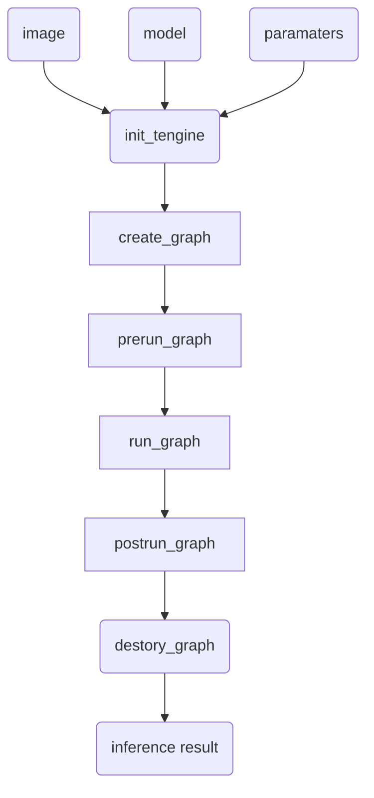

# Tengine Reasoning Flow
Invoke the Tengine core API in sequence as follows：

## 1. <font color=blue>init_tengine</font>

Initialize Tengine, which can be called only once in the program。

## 2. <font color=blue>create_graph</font>

Create a Tengine calculation diagram。

## 3. <font color=blue>prerun_graph</font>

Pre-run, prepare the resources needed for computing graph reasoning. Set the size of the core, the number of cores, nuclear affinity and data accuracy are all here.

```c
struct options
{
  int num_thread;	//Number of threads
  int cluster;		//Size kernel setting, TENGINE_CLUSTER_[ALL,BIG，MEDIUM，LITTLE]
  int precision;	//Accuracy setting，TENGINE_MODE_[FP32,FP16,HYBRID_INT8,UINT8,INT8]
  uint64_t affinity;//Core affinity mask, binding specific core
};
```


## 4. <font color=blue>run_graph</font>

Start Tengine calculation graph reasoning.

## 5. <font color=blue>postrun_graph</font>

Stop running graph and release the resources occupied by graph. 

## 6. <font color=blue>destroy_graph</font>

Destroy graph. Postrun_graph and destroy_graph are called after executing the model reasoning, and they are usually called continuously. Mermaid using markdown flowchart is expressed as follows:

>

>
| |
| ------------------------------------------------------------ |
| Figure 1 Inference Process  