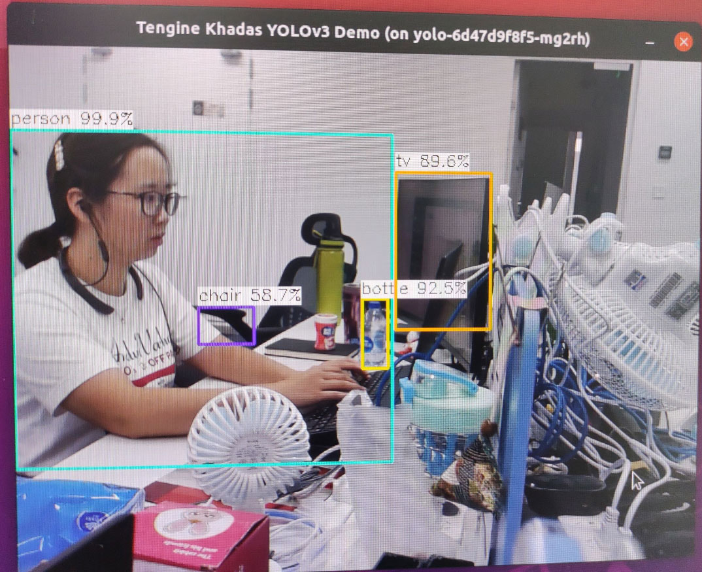

# Deploy Edge AI App In a Second With Tengine and SuperEdge 
------------
## Introduction

​		This example demonstrates how to deploy edge AI apps in a second. With the help of Tengine, an open-source inferencing Framework, developers can  leverage CPU, GPU or edge AI accelerator to process real-time object detection task  within a container. And also using the open-source edge computing orchestration, SuperEdge, developers can deploy applications to the edge node rapidly with a full set of edge computing features available.

​		[Tengine](https://github.com/OAID/Tengine "Tengine") is developed by **[OPEN AI LAB](http://www.openailab.com/)**. This project meet the demand of **fast** and **efficient** deployment of deep learning neural network models on embedded devices. In order to achieve cross-platform deployment in many **AIoT** applications, this project is based on the original Tengine project using **C language** for reconstruction, and deep frame tailoring for the characteristics of limited embedded device resources. Also, it adopts a completely separated front-end/back-end design, which makes it possible to be transplanted and deployed onto CPU, GPU, NPU and other heterogeneous computing units rapidly, conveniently. At the same time, it is compatible with the original API and model format `tmfile` of **Tengine**, which reduces the cost of evaluation and migration.

​		[SuperEdge](https://github.com/superedge/superedge "SuperEdge") is an open source **container management system for edge computing** to manage compute resources and container applications in multiple edge regions. These resources and applications, in the current approach, are managed as one single **Kubernetes** cluster. A native Kubernetes cluster can be easily converted to a SuperEdge cluster.

## Prerequisites

| Hardware      | Detail                                                       |
| ------------- | ------------------------------------------------------------ |
| Master Server | SuperEdge Master Server，X86 server,                         |
| Khadas VIM3   | SuperEdge Workload Node，An arm based SBC with built-in A311D SoC, 5Tops NPU accelerator |
| USB Camera    | Connect to Khadas VIM3, Input real-time video stream         |
| Monitor       | Connect to Khadas VIM3, Console operation, Real-time output video |
| HDMI Cable    | Cable to connect Khadas VIM3 and monitor                     |

## Procedure

### 1. Install SuperEdge 

- Install SuperEdge Master（x86_64）
```shell
wget https://superedge-1253687700.cos.ap-guangzhou.myqcloud.com/v0.4.0/amd64/edgeadm-linux-amd64-v0.4.0.tgz
tar -zxvf edgeadm-linux-amd64-v0.4.0.tgz
cd edgeadm-linux-amd64-v0.4.0
./edgeadm init --kubernetes-version=1.18.2 --image-repository superedge.tencentcloudcr.com/superedge --service-cidr=10.96.0.0/12 --pod-network-cidr=10.224.0.0/16 --install-pkg-path ./kube-linux-*.tar.gz --apiserver-cert-extra-sans=<Master Public IP> --apiserver-advertise-address=<Master Intranet IP> --enable-edge=true
#Copy k8s config into user folder
mkdir -p $HOME/.kube
sudo cp -i /etc/kubernetes/admin.conf $HOME/.kube/config
sudo chown $(id -u):$(id -g) $HOME/.kube/config
#Remove resource restrictions,work-around for crash issue in khadas VIM3 kernal
kubectl patch DaemonSet kube-proxy -n kube-system --type='json' -p='[{"op": "replace", "path": "/spec/template/spec/containers/0/resources", "value":{}}]'
kubectl patch DaemonSet kube-flannel-ds -n kube-system --type='json' -p='[{"op": "replace", "path": "/spec/template/spec/containers/0/resources", "value":{}}]'
kubectl patch DaemonSet tunnel-edge -n edge-system --type='json' -p='[{"op": "replace", "path": "/spec/template/spec/containers/0/resources", "value":{}}]'
kubectl patch DaemonSet edge-health -n edge-system --type='json' -p='[{"op": "replace", "path": "/spec/template/spec/containers/0/resources", "value":{}}]'
kubectl patch DaemonSet application-grid-wrapper-node -n edge-system --type='json' -p='[{"op": "replace", "path": "/spec/template/spec/containers/0/resources", "value":{}}]'
```
- Add Khadas VIM3 node to the cluster
```shell
# Since the demo uses the desktop GUI, the application cannot be bringup normally in reboot case if the login windows is on, so it is better to set automatically login when device restarts
#Steps: Turn on "Setting" - "Users"- "AutoLogin" configuration at the upper right of GUI desktop. Now,device skips the login screean after reboot and bringup.

#Disable fenix-zram-config service to disable the swap 
sudo systemctl disable fenix-zram-config
sudo systemctl status fenix-zram-config

# Download edgeadm arm64 version to install SuperEdge Node 
wget https://superedge-1253687700.cos.ap-guangzhou.myqcloud.com/v0.4.0/arm64/edgeadm-linux-arm64-v0.4.0.tgz
tar -zxvf edgeadm-linux-arm64-v0.4.0.tgz
cd edgeadm-linux-arm64-v0.4.0

#Upgrade cni-plugins from v0.8.3 to v0.8.6, to solve the cni plugin installation failure.
tar -zxvf kube-linux-arm64-v1.18.2.tar.gz
wget https://github.com/containernetworking/plugins/releases/download/v0.8.6/cni-plugins-linux-arm64-v0.8.6.tgz
mv cni-plugins-linux-arm64-v0.8.6.tgz edge-install/cni/cni-plugins-linux-arm64-v0.8.3.tgz
sed -i 's/\tload_kernel/# load_kernel/' edge-install/script/init-node.sh
tar -zcvf kube-linux-arm64-v1.18.2.1.tar.gz edge-install/

#Join the cluster
./edgeadm join <Master Public/Intranet IP Or Domain>:6443 --token xxxx --discovery-token-ca-cert-hash sha256:xxxxxxxxxx --install-pkg-path kube-linux-arm64-v1.18.2.1.tar.gz --enable-edge=true
```
- Enable Xserver authorization in Khadas VIM3 
```shell
# Access to Xserver
# Execute script on device Terminal
xhost +
```

### 2.(Optional) Build the Tengine Demo Image
------------
This step describes how to build the Tengine Demo image. If you use the Docker Hub pre-build image, you can skip it.

- Download the file package to the Khadas VIM3 device, and build the Tengine object detection image manually
```shell
#Download docker build packeage [~91M] from OPEN AI LAB server
wget http://tengine2.openailab.com:9527/openailab/yolo.tar.gz
tar -zxvf yolo.tar.gz
cd superedge
docker build -t yolo:latest .
```
Dockerfile as follows:
```
FROM ubuntu:20.04
MAINTAINER openailab
RUN apt-get update
RUN apt-get install -y tzdata
RUN apt-get install -y libopencv-dev
RUN apt-get install -y libcanberra-gtk-module
RUN useradd -m openailab
COPY libtengine-lite.so /root/myapp/
COPY demo_yolo_camera /root/myapp/
COPY tm_330_330_330_1_3.tmcache /root/myapp/
ADD models /root/myapp/models/
COPY tm_88_88_88_1_1.tmcache /root/myapp/
COPY tm_classification_timvx /root/myapp/
COPY libOpenVX.so /lib/
COPY libGAL.so /lib/
COPY libVSC.so /lib/
COPY libArchModelSw.so /lib/
COPY libNNArchPerf.so /lib/
COPY libgomp.so.1 /lib/aarch64-linux-gnu/
COPY libm.so.6 /lib/aarch64-linux-gnu/
WORKDIR /root/myapp/
USER openailab
CMD ["./demo_yolo_camera"]
```
If you want to compile and generate the demo_yolo_camera program yourself, please refer to the specific operation in [demo_videocapture user manual](https://github.com/OAID/Tengine/blob/tengine-lite/doc/demo_videocapture_user_manual.md "demo_videocapture user manual")

### 3.Preprare the Deployment File

- Create k8s Deployment file yolo.yaml in 在SuperEdge master
```yaml
apiVersion: apps/v1
kind: Deployment
metadata:
  name: yolo
  labels:
    name: yolo
spec:
  replicas: 1
  selector:
    matchLabels:
      name: yolo
  template:
    metadata:
      labels:
        name: yolo
    spec:
      affinity:
        nodeAffinity:
          requiredDuringSchedulingIgnoredDuringExecution:
            nodeSelectorTerms:
              - matchExpressions:
                  - key: kubernetes.io/hostname
                    operator: In
                    values:
                      - khadas
      containers:
        - name: yolo
          image: tengine3/yolo:v1.0
          env:
          - name: DISPLAY
            value: :0
          volumeMounts:
            - name: dev
              mountPath: /dev
            - name: unix
              mountPath: /tmp/.X11-unix
          securityContext:
            privileged: true
      volumes:
        - name: dev
          hostPath:
            path: /dev
        - name: unix
          hostPath:
            path: /tmp/.X11-unix
```
### 4.Apply the Application

- Execute cli to apply the deployment


```shell
kubectl apply -f yolo.yaml
```
### 5.Result and Verification

- Check the status of deployments and pods with k8s cli in master


```
peter@peter-VirtualBox:~$ kubectl get deployment yolo -o wide
NAME   READY   UP-TO-DATE   AVAILABLE   AGE   CONTAINERS   IMAGES               SELECTOR
yolo   1/1     1            1           21h   yolo         tengine3/yolo:v1.0   name=yolo

peter@peter-VirtualBox:~$ kubectl get pod yolo-76d95967bb-zxggk 
NAME                    READY   STATUS    RESTARTS   AGE
yolo-76d95967bb-zxggk   1/1     Running   3          79m

```

- You Make it now!  Enjoy it and Check the  detection results in monitor. 





