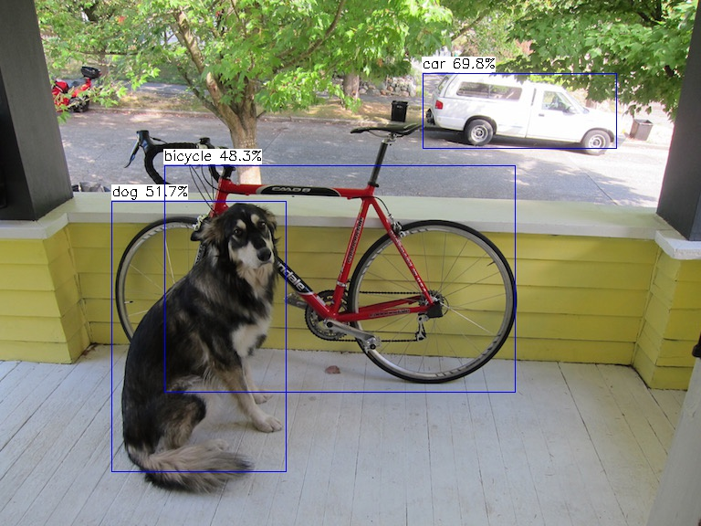

# Tengine Lite with Opensource DeepLearning Accelerator
## 1. Introduction
Opendla is based on Nvidia's open source accelerator, NVDLA. It was named opendla because nvidia's official warehouse has been out of maintenance for two years. It is clear that there is still room for improvement.Temporarily in [ZYNQ - NVDLA] (https://github.com/LeiWang1999/ZYNQ-NVDLA), the maintenance warehouse.
The current back-end only connects to the NVDLA Small configuration and has the following features:
1. ZYNQ 7045 | XCZU9EG - 2 can run up to 100 Mhz
2. 8\*8 PE array
3. There is no Global SRAM cache
4. No lookup table circuit
5. No RUBIK data rearrangement engine
6. The supported operators are: Conv | Relu | Min/Max/Avg Pooling | FullyConntected | ElementWise Other operators will be cut to the CPU to run
## 2. How to compile
### 2.1 dependencies
A dependency has three parts:
> The first part is the chip corresponding opendla. Ko program, in [this article] (https://zhuanlan.zhihu.com/p/378202360) has introduced how to compile,Currently placed in warehouse [] (https://github.com/LeiWang1999/ZYNQ-NVDLA) version is in view of the Linux 4.13 kernel, if there is other kernel version need to change some functions;
> The second part is the NVDLA dependency library, including libjpeg and libprotobuf, which can be used directly in the aARCH64 architecture.
> The third part is the Compiler and Runtime supported by NVDLA, which need to be compiled into the link library and put into the lib directory. If the aARCH64 architecture can use the precompiled files directly.
### 2.2 Compilation process
In order to understand the process of the whole process, first describe the process of compiling the complete process.
To compile Tengine's Opendla back-end support code, you first compile libcompiler.so and libruntime.so, which are dependent on libProtobuf (version 2.6.1).Libruntime relies on libjpeg (the version is libjpeg6b).
### 2.3 Pull code
First, **the entire compilation process shown here is run on the development board**, otherwise cross compilation is required;The examples are all run as root;How to use the development board connected can refer to [this article] (https://zhuanlan.zhihu.com/p/378814739).
#### 2.3.1 Pull zynq-nvDLA
```bash
$git clone https://github.com/LeiWang1999/ZYNQ-NVDLA #clone not down just use SFTP preach up local download:D
```
#### 2.3.2 Pulling tengine-Lite
```bash
$ git clone https://github.com/OAID/Tengine.git Tengine
```
### 2.4 Tengine-Lite integration with Opendla
Tengine-lite currently supports only one integrated compilation method for Opendla, which is to compile Opendla's software support by first generating.so files and linking them when Tengine compiles opendla's back end.
Other alternatives, such as compiling opendla's compiler and runtime source code with Tengine during compilation, are not yet supported because the code must be refacfacted.
Here is not the kernel driver ` opendla. Ko ` is how to compile, how to compile in a Petalinux look at this article [article] (https://zhuanlan.zhihu.com/p/378202360).
If it's an AARCH64 architecture,You can directly use lib [prebuilt] (https://github.com/LeiWang1999/ZYNQ-NVDLA/tree/master/prebuilt/lib/aarch64-ubuntu).
#### 2.4.0 Load the kernel driver
```bash
$ insmod /lib/modules / 4.19.0 - xilinx - v2019.1 / extra/opendla.ko
```
To view kernel logs using DMESG:
```bash
$ dmesg | tail
[12.817877] MACB ff0e0000. Ethernet eth0: Link up (1000/Full)
[12.817900] IPv6: ADDRCONF(NETDEV_CHANGE): eth0: Link becomes ready
[20.661453] Opendla: Loading out-of-tree module taints kernel.
[20.664248] Probe NVDLA config nvidia,nv_small
[20.669152] 0.5
[20.669155] Reset engine done
[20.671257] Initialized NVDLA 0.0.0 20171017 for A0000000.NV_nvdla_wrapper on minor 1
```
Check to see if nvDLA interrupts are registered and if the device 'renderD128' required for the NVDLA driver exists to determine if the driver is actually installed:
```bash
root@arm:~# insmod/lib/modules / 4.19.0 - xilinx - v2019.1 / extra/opendla ko
root@arm:~# cat /proc/interrupts | grep nvdla
45:0 0 gic-0 61 Level 40000000.NV_nvdla_wrapper
root@arm:~# ls /dev/dri/
Card0 renderD128
```
#### 2.4.1 Compile libjpeg6b
For AARCH64, skip this step and go straight to libjpe.a in the repository.
```bash
$ wget http://www.ijg.org/files/jpegsrc.v6b.tar.gz
$ tar -xzvf jpegsrc.v6b.tar.gz
$ cd jpeg-6b/
$ ./configure
$ make -j `nproc`
$ make install
$cp/usr/local/lib/libjpeg. A ~ / ZYNQ NVDLA/umd/external /
```
#### 2.4.2 Compiling libprotobuf.a
```bash
$CD ~ / ZYNQ NVDLA/umd/external/protobuf - 2.6 /
$ apt-get install -y autoconf automake libtool
$ autoscan & aclocal & autoconf
$ automake --add-missing
$ ./configure
$ make -j `nproc`
$ make install
$ cp /usr/local/lib/libprotobuf.a ~/ZYNQ-NVDLA/umd/apps/compiler/
$ cp /usr/local/lib/libprotobuf.a ~/ZYNQ-NVDLA/umd/core/src/compiler/
```
#### 2.4.3 Compile Compiler and Runtime
```bash
$ cd ~/ZYNQ-NVDLA/umd/
$ make -j `nproc` TOP=${PWD} TOOLCHAIN_PREFIX=/usr/bin/ compiler
$ make -j `nproc` TOP=${PWD} TOOLCHAIN_PREFIX=/usr/bin/ runtime
```
This will generate the required lib in the out directory. Copy lib and include to the Tengine directory:

```bash
$ cp ~/ZYNQ-NVDLA/include -r ~/Tengine/source/device/opendla
$ cp ~/ZYNQ-NVDLA/umd/out/core/src/compiler/libnvdla_compiler/libnvdla_compiler.so -r ~/Tengine/source/device/opendla/lib/
$ cp ~/ZYNQ-NVDLA/umd/out/core/src/runtime/libnvdla_runtime/libnvdla_runtime.so -r ~/Tengine/source/device/opendla/lib/
$ cp /usr/local/lib/libprotobuf.a ~/Tengine/source/device/opendla/lib/
```
#### 2.4.4 Compiling Tengine
```bash
$ cd ~/Tengine
$ mkdir build & cd build
$ cmake .. -DTENGINE_ENABLE_OPENDLA=ON
```
## 3. Demo
#### 3.1 Classification
**Resnet18-Cifar10**
```bash
$ cd <tengine-lite-root-dir>/build
$ cmake --build . --target tm_classification_opendla
$ cd examples
$ ./tm_classification_opendla -m /root/Tengine/models/resnet18-cifar10-nosoftmax-relu_int8.tmfile -i / root/Tengine/images/the JPG - g 32, 32-1,1,1 s
Mean value not specified, use default 104.0, 116.7, 122.7
Tengine - lite library version: 1.4 dev
NVDLA time: 0.012502 seconds

model file : /root/Tengine/models/resnet18-cifar10-nosoftmax-relu_int8.tmfile
image file : /root/Tengine/images/cat.jpg
Img_h, IMg_w, scale[3], mean[3] : 32 32, 1.000 1.000 1.000, 104.0 116.7 122.7
Repeat 1 times, thread 1, avg time 12.62ms, max_time 12.62ms, min_time 12.62ms
--------------------------------------
10.087049, 3
3.833079, 2
3.026115, 5
2.420892, 4
0.403482, 0
--------------------------------------
```
#### 3.2 Detection
**Yolox-nano**
```bash
$ cd <tengine-lite-root-dir>/build
$ cmake --build . --target tm_classification_opendla tm_yolox_opendla
$ cd examples
$ ./tm_yolox_opendla -m /root/Tengine/models/yolox_nano_relu_int8.tmfile -i /root/Tengine/images/dog.jpg -r 1
Tengine - lite library version: 1.4 dev
Repeat 1 times, thread 1, avg time 1138.80ms, max_time 1138.80ms, min_time 1138.80ms
--------------------------------------
detection num: 3
2: 70%, [463, 80, 676, 163], car
16: 52%, [122, 220, 315, 517], dog
1: 48%, [180, 181, 564, 430], bicycle
```
Output:


## Addendum: Others
Welcome to join QQ group 829565581 to discuss together!