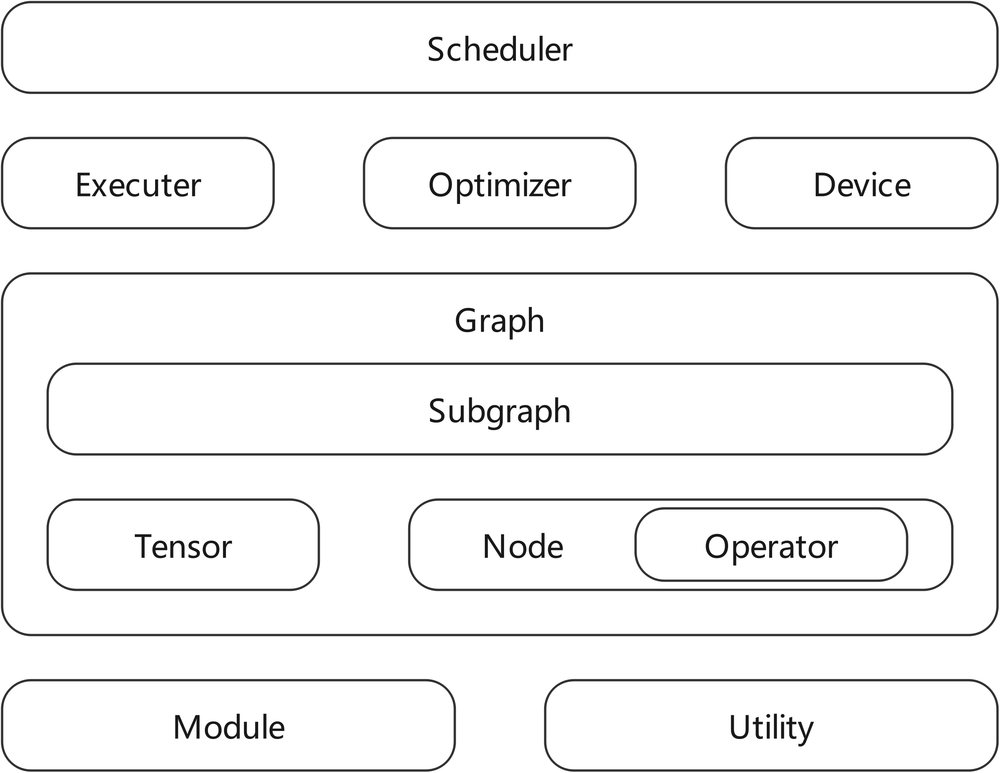

# 架构详解

------

## 设计背景

### 先行者 **Tengine**
最早的 **Tengine** 是使用 `C++` 分层设计的，编译采用 `make`，也就是嵌入系统常常采用的 `makefile`，编写之初支持的硬件是 CPU。可扩展性是 `Tengine` 和现在的 `Lite` 版本的设计核心，不仅仅是 `Operator` 能够很方便的通过注册宏扩展，各个主要模块也是扩展的。

推出 `Tengine` 发展一段时间后，市场反馈需要 `Tengine` 支持 `MCU` 和 `VLIW` 架构的 `DSP`；在一些项目中，编译工具链对 `C++` 较新标准支持较差，甚至是没有 `C++` 编译器，这就对 `Tengine` 的架构产生了新的要求。

在这种背景下，项目团队提出重新设计代号 `Lite` 的 `Tengine` 纯 `C` 语言的新主要分支，经过一段时间的开发后，后续项目陆续切换到 `Tengine Lite` 上。从能力上，`Lite` 和原分支是一样的。经过一段时间后，全部 `Tengine` 项目维护周期终结后，`Tengine` 分支将会进入存档冻结状态，不再维护。

### 继任者 **Tengine Lite** 
“薪火相传 砥砺前行”，**Tengine Lite** 的早期版本主题设计和 **Tengine** 高度相似，较早的 **Tengine Lite** 版本注册机制依赖 `GNU C` 扩展，而 `GNU C` 扩展并不是标准 `C` 的内容。当社区呼唤需要扩展支持到非 `GCC` 系列的场景，如 `Microsoft Visual Studio` 上时，遇到了较多的困难。另一方面，纯 `C` 的设计使得 `Tengine Lite` 的入手难度较高，社区和项目反馈需要提高易用性，“**Tengine** 从入门到‘放弃’”的时间要“显著”缩短。

经过一段时间的磨合后，团队决定重新设计主要模块，重点是解决这几方面的问题。

## 架构设计
重新设计的设计目标之一是，采用纯 `C` 设计 **Tengine** 的 **Lite** 分支(以下简称 **Tengine**，不再强调 **Lite** 分支)最小 `Runtime`，复杂的功能和逻辑可以使用 `C++` 开发。这样保持纯 `C Runtime` 在局限场景下优势的同时，使用 `C++` 开发复杂模块，使注意力集中在开发算法本身上。

### 架构概览


### 重要模块介绍

#### 网络描述 `graph` 和相关结构体
`source/graph` 目录下是 `Convolution Neural Network` 的描述结构体和函数。
``` C
/*!
 * @struct ir_graph_t
 * @brief  Abstract graph intermediate representation
 */
typedef struct graph
{
    struct tensor** tensor_list;            //!< the tensor list of a graph
    struct node**   node_list;              //!< the node list of a graph
    int16_t* input_nodes;                   //!< input nodes index array of a graph
    int16_t* output_nodes;                  //!< output nodes index array of a graph

    uint16_t tensor_num;                    //!< the count of all graph tensor
    uint16_t node_num;                      //!< the count of all graph node
    uint16_t input_num;                     //!< input nodes index count of a graph
    uint16_t output_num;                    //!< input nodes index count of a graph

    int8_t   graph_layout;                  //!< the data layout of a graph
    int8_t   model_layout;                  //!< model layout of graph source model
    int8_t   model_format;                  //!< model format of graph source model

    uint8_t  status;                        //!< the status of graph

    struct   serializer* serializer;        //!< serializer of graph
    void*    serializer_privacy;            //!< privacy data of serializer

    struct   device* device;                //!< assigned nn_device for this graph
    void*    device_privacy;                //!< privacy data of device

    struct   attribute*  attribute;         //<! attribute of graph

    struct vector* subgraph_list;           //!< subgraph list of this graph
} ir_graph_t;
```
网络的主体 `DAG` 由 `graph` 和其中的 `node` 节点共同描述；全部需要的 `node` 在 `node->node_list` 中存储；`node` 主要描述了该节点的依赖 `tensor` 和 `operator` 情况。所有需要的 `tensor` 在 `graph->tensor_list` 中存储。`graph->node_num` 和 `graph->tensor_num` 分别描述了 `graph` 的 `node` 和 `tensor` 数量。数据(`tensor`) + 操作(`operator`)构成的节点(`node`)最后构成一个完整的图(`graph`)，根据调度器(`scheduler`)模块的分配，形成一个完整的运行图运行在 `CPU` 设备(`device`)上，这也是典型的 `CPU` 跑 `CNN` 模型的应用场景。

``` C
/*!
 * @struct ir_node_t
 * @brief  Abstract node intermediate representation
 */
typedef struct node
{
    uint16_t  index;            //!< the index of a node
    uint8_t   dynamic_shape;    //!< flag of dynamic shape
    uint8_t   input_num;        //!< count of input tensor
    uint8_t   output_num;       //!< count of output tensor
    uint8_t   node_type;        //!< type of node: { input, output, intermediate }
    int8_t    subgraph_idx;     //!< id of the owner subgraph

    uint16_t* input_tensors;    //!< id array of input tensor
    uint16_t* output_tensors;   //!< id array of output tensor

    char* name;                 //!< name of a node

    struct op op;               //!< operator of a node
    struct graph* graph;        //!< pointer of the related graph
} ir_node_t;
```
`node` 是网络的节点，不同功能的 `node` 协助完成数据准备和计算的工作。`node->input_tensors` 和 `node->output_tensors` 分别描述了一个 `node` 的输入输出 `tensor` 的索引 `index`，结合 `node->input_num` 和 `node->output_num` 就可以完成节点的遍历。实际的 `node` 是存储在 `graph->node_list` 中的。

``` C
/*!
 * @struct ir_tensor_t
 * @brief  Abstract tensor intermediate representation
 */
typedef struct tensor
{
    uint16_t index;                          //!< the index of a tensor
    int16_t  producer;                       //!< node id, '-1' means no producer
    int16_t  consumer[TE_MAX_CONSUMER_NUM];  //!< consumer nodes array

    uint8_t  reshaped;                       //!< the tensor's shape has changed
    uint8_t  consumer_num;                   //!< count of consumer nodes
    uint8_t  tensor_type;                    //!< tensor_type: { const, input, var, dep }
    uint8_t  data_type;                      //!< data_type: { int8, uint8, fp32, fp16, int32 }
    uint8_t  dim_num;                        //!< count of dimensions
    uint8_t  elem_size;                      //!< size of single element
    uint8_t  subgraph_num;                   //!< count of all subgraph those will waiting this tensor ready
    uint8_t  free_host_mem;                  //!< should free host memory?
    uint8_t  internal_allocated;             //!< how memory is allocated?
    uint8_t  layout;                         //!< tensor layout: { TENGINE_LAYOUT_NCHW, TENGINE_LAYOUT_NHWC }

    uint16_t quant_param_num;                //!< quantization dimension
    uint32_t elem_num;                       //!< count of total elements
    int dims[TE_MAX_SHAPE_DIM_NUM];          //!< shape dimensions

    /*!
     * @union anonymity data pointer
     * @brief give useful pointer pointer
     */
    union
    {
        void*    data;
        int8_t*    i8;
        uint8_t*   u8;
        float*    f32;
        uint16_t*   f16;
        int32_t*  i32;
    };

    char* name;                             //!< tensor name

    /*!
     * @union anonymity quantization scale union
     * @brief scale or its array
     */
    union
    {
        float* scale_list;
        float  scale;
    };

    /*!
     * @union anonymity quantization zero point union
     * @brief zero point or its array
     */
    union
    {
        int  zero_point;
        int* zp_list;
    };

    struct dev_mem* dev_mem;
    uint8_t* subgraph_list;                 //!< subgraph index list of those subgraph will waiting this tensor ready
} ir_tensor_t;
```
`tensor` 是 `node` 完成功能的数据基础。`tensor->dims` 描述了 `tensor` 的 `shape`；`tensor->quant_param_num`, `tensor->scale` 或 `tensor->scale_list`，`tensor->zero_point` 或 `tensor->zp_list` 三者共同描述了 `tensor` 的量化情况，具体的数值类型由 `tensor->data_type` 描述。
当用户通过 `API` 对函数进行修改后，`tensor->free_host_mem` 和 `tensor->internal_allocated` 会进行变化，用来区分是由内部释放还是用户手动释放。

``` C
/*!
 * @struct ir_op_t
 * @brief  Abstract operator intermediate representation
 */
typedef struct op
{
    uint16_t type;                          //!< the type of a operator
    uint8_t  version;                       //!< the version of a operator
    uint8_t  same_shape;                    //!< the flag of weather the operator will keep shape
    uint16_t param_size;                    //!< size of parameter memory buffer
    void* param_mem;                        //!< parameter memory buffer
    int (*infer_shape)(struct node*);       //!< infer(or broadcast) the shape from input to output(s)
} ir_op_t;
```
`operator` 是 `node` 完成功能的行为基础。`op->type` 描述了类型，这是这个 `op` 的行为基础。

``` C
/*!
 * @struct ir_subgraph_t
 * @brief  Abstract subgraph intermediate representation
 */
typedef struct subgraph
{
    uint8_t   index;                //!< the index of a subgraph
    uint8_t   input_ready_count;    //!< the count of all in ready input tensors
    uint8_t   input_wait_count;     //!< the count of all out of ready input tensors
    uint8_t   input_num;            //!< the count of input tensors
    uint8_t   output_num;           //!< the count of output tensors
    uint8_t   status;               //!< the execution status of subgraph

    uint16_t  node_num;             //!< the count of nodes in subgraph
    uint16_t* node_list;            //!< all nodes index list of subgraph

    uint16_t* input_tensor_list;    //!< input tensors index list of subgraph
    uint16_t* output_tensor_list;   //!< output tensors index list of subgraph

    struct graph*  graph;           //!< the pointer of the related graph

    struct device* device;          //!< the device which will the subgraph running on
    void*  device_graph;            //!< the related device graph
} ir_subgraph_t;
```
`subgraph` 是设备有关的，一个 `subgraph` 只工作于一个单一 `device`。当网络的全部 `node` 完全运行于单一 `device` 时，`subgraph` 就包含全部 `graph` 中的 `node`。当运行于多 `device` 时，根据实际 `device` 的 `operator` 支持情况，划分不同的 `node` 到多个不同的 `subgraph` 中。最小的 `subgraph` 只包含一个 `node` 节点；最大的 `subgraph` 有全部的 `node`。

#### 设备描述 `device` 和相关结构体
`source/device` 目录下是 `Convolution Neural Network` 的描述结构体和函数，子目录中是各种 `device` 的实现。其中 `source/device/cpu` 是 **Tengine** 支持的全部 `CPU` 的相关代码。

``` C
/*!
 * @struct nn_device_t
 * @brief  Abstract neural network runnable device description struct
 */
typedef struct device
{
    const char* name;
    struct interface* interface;      //!< device scheduler operation interface
    struct allocator* allocator;      //!< device allocation operation interface
    struct optimizer* optimizer;      //!< device optimizer operation interface
    struct scheduler* scheduler;      //!< device scheduler
    void*  privacy;                   //!< device privacy data
} ir_device_t;
```
`device` 是由嵌套的结构体构成的，结合描述了三类主要接口。关于详细细节和如何添加 `device` 还可以参考 **扩展硬件后端** 文档。

每当实现一个 `device` 的时候，都需要调用 `int register_device(struct device* device);` 函数，将 `device` 注册到 **Tengine** 中。运行时，可以通过 `int add_context_device(context_t context, const char* dev_name);` 和 `int set_context_device(context_t context, const char* dev_name, const void* dev_option, size_t dev_opt_size);` 设置需要使用的 `device`，对于带有 `option` 的 `device`，更推荐用后一个接口一并设置 `option`。比如，在 `TensorRT device` 中，需要初始化时指定多个 `GPU` 以及推理精度时特别有用。`CPU device` 被假设为总是可用。 

#### 模型解析 `serializer` 和相关结构体

``` C
/*!
 * @struct serializer_t
 * @brief  Abstract serializer
 */
typedef struct serializer
{
    const char* (*get_name)(struct serializer*);

    //!< load model from file
    int (*load_model)(struct serializer*, struct graph*, const char* fname, va_list ap);

    //!< load model from memory
    int (*load_mem)(struct serializer*, struct graph*, const void* addr, int size, va_list ap);

    //!< unload model, free serializer and device related resource
    int (*unload_graph)(struct serializer*, struct graph*, void* s_priv, void* dev_priv);

    //!< interface exposed for register operator extension
    int (*register_op_loader)(struct serializer*, int op_type, int op_ver, void* op_load_func, void* op_type_map_func, void* op_ver_map_func);

    //!< interface exposed for register operator extension
    int (*unregister_op_loader)(struct serializer*, int op_type, int op_ver, void* op_load_func);

    //!< interface exposed for initialize serializer
    int (*init)(struct serializer*);

    //!< interface exposed for release serializer
    int (*release)(struct serializer*);
} serializer_t;
```
支持新的模型格式解析，只需要填充并注册一个 `serializer` 即可完成。**Tengine** 正计划通过此模块将主流的模型支持增加进来。

#### 模块注册
**Tengine** 能够工作有赖于注册的各个模块，这些注册接口和位置可以参考 `source/module` 目录下的相关代码。

``` C
static vector_t* internal_serializer_registry = NULL;   //!< registry of model serializer
static vector_t* internal_device_registry     = NULL;   //!< registry of runnable neural network device
static vector_t* internal_op_method_registry  = NULL;   //!< registry of operators
static vector_t* internal_op_name_registry    = NULL;   //!< registry of operators name
```

从 `source/module/module.c` 中的 `static struct vector` 中可以知道， `serializer`，`device` 和 `operaor` 都被注册为 `vector` 中，在 `module.h` 中提供了注册和查找的函数。

``` C

/*!
 * @brief Register a serializer.
 *
 * @param [in]  serializer: The pointer to a struct of serializer.
 *
 * @return statue value, 0 success, other value failure.
 */
int register_serializer(struct serializer* serializer);


/*!
 * @brief Find the serializer via its name.
 *
 * @param [in]  name: The name of serializer.
 *
 * @return  The pointer of the serializer.
 */
struct serializer* find_serializer_via_name(const char* name);


/*!
 * @brief Find the serializer via its registered index.
 *
 * @param [in]  index: The index of serializer.
 *
 * @return  The pointer of the serializer.
 */
struct serializer* find_serializer_via_index(int index);


/*!
 * @brief Get count of all registered serializer.
 *
 * @return  The count of registered serializer.
 */
int get_serializer_count();


/*!
 * @brief Unregister a serializer.
 *
 * @param [in]  serializer: The pointer to a struct of serializer.
 *
 * @return statue value, 0 success, other value failure.
 */
int unregister_serializer(struct serializer* serializer);


/*!
 * @brief Release all serializer.
 *
 * @return statue value, 0 success, other value failure.
 */
int release_serializer_registry();


/*!
 * @brief Register a device.
 *
 * @param [in]  device: The pointer to a struct of device.
 *
 * @return statue value, 0 success, other value failure.
 */
int register_device(struct device* device);


/*!
 * @brief Find the device via its name.
 *
 * @param [in]  name: The name of device.
 *
 * @return  The pointer of the device.
 */
struct device* find_device_via_name(const char* name);


/*!
 * @brief Find the default device.
 *
 * @return  The pointer of the device.
 */
struct device* find_default_device();


/*!
 * @brief Find the device via its registered index.
 *
 * @param [in]  name: The index of device.
 *
 * @return  The pointer of the device.
 */
struct device* find_device_via_index(int index);


/*!
 * @brief Get count of all registered device.
 *
 * @return  The count of registered device.
 */
int get_device_count();


/*!
 * @brief Register a device.
 *
 * @param [in]  device: The pointer to a struct of device.
 *
 * @return statue value, 0 success, other value failure.
 */
int unregister_device(struct device* device);


/*!
 * @brief Release all device.
 *
 * @return statue value, 0 success, other value failure.
 */
int release_device_registry();


/*!
 * @brief Register an operator method.
 *
 * @param [in]  type: The type of an operator.
 * @param [in]  type: The name of an operator.
 * @param [in]  type: The method of an operator.
 *
 * @return statue value, 0 success, other value failure.
 */
int register_op(int type, const char* name, struct method* method);


/*!
 * @brief Find an operator method.
 *
 * @param [in]  type: The type of an operator method.
 * @param [in]  version: The version of an operator method.
 *
 * @return  The pointer of the method.
 */
struct method* find_op_method(int type, int version);


/*!
 * @brief Find an operator method via its registered index.
 *
 * @param [in]  index: The index of operator method.
 *
 * @return  The pointer of the operator method.
 */
struct method* find_op_method_via_index(int index);


/*!
 * @brief Find an operator name.
 *
 * @param [in]  type: The type of an operator method.
 *
 * @return  The char array of the method.
 */
const char* find_op_name(int type);


/*!
 * @brief Get count of all registered operator method.
 *
 * @return  The count of registered operator method.
 */
int get_op_method_count();


/*!
 * @brief Register an operator.
 *
 * @param [in]  type: The type of an operator method.
 * @param [in]  version: The version of an operator method.
 *
 * @return statue value, 0 success, other value failure.
 */
int unregister_op(int type, int version);


/*!
 * @brief Release all operator.
 *
 * @return statue value, 0 success, other value failure.
 */
int release_op_registry();
```

`C` 语言是没有 `C++` 构造函数概念的，那么如果不做处理，就需要一套运行时注册和反注册的机制。在 **Tengine** v1.4 以后，注册的另一部分通过 CMake 完成。
通过一定规则扫描和收集到的文件，可以通过 `cmake/registry.cmake` 文件中添加的 `GENERATE_REGISTER_HEADER_FILE(_REG_LEAD_STRING _DEL_LEAD_STRING _BACK_STRING _CONFIG_FILE _TARGET_FILE)` 函数进行文件生成。

``` cmake
# generate needed registry
FUNCTION (GENERATE_REGISTER_HEADER_FILE _REG_LEAD_STRING _DEL_LEAD_STRING _BACK_STRING _CONFIG_FILE _TARGET_FILE)
    SET (_BGN_NOTICE_STR "// code generation start\n")
    SET (_END_NOTICE_STR "// code generation finish\n")

    SET (_GEN_REG_DEF_STR "${_BGN_NOTICE_STR}")
    SET (_GEN_REG_CAL_STR "${_BGN_NOTICE_STR}")
    SET (_GEN_DEL_DEF_STR "${_BGN_NOTICE_STR}")
    SET (_GEN_DEL_CAL_STR "${_BGN_NOTICE_STR}")

    FOREACH (_VAR ${ARGN})
        STRING(REGEX REPLACE ".+/(.+)\\..*" "\\1" _NAME ${_VAR})

        SET (_REG_FUNC "${_REG_LEAD_STRING}${_NAME}${_BACK_STRING}()")
        SET (_DEL_FUNC "${_DEL_LEAD_STRING}${_NAME}${_BACK_STRING}()")

        SET (_GEN_REG_DEF_STR "${_GEN_REG_DEF_STR}extern int ${_REG_FUNC};\n")

        SET (_GEN_REG_CAL_STR "${_GEN_REG_CAL_STR}    ret = ${_REG_FUNC};\n")
        SET (_GEN_REG_CAL_STR "${_GEN_REG_CAL_STR}    if(0 != ret)\n")
        SET (_GEN_REG_CAL_STR "${_GEN_REG_CAL_STR}    {\n")
        SET (_GEN_REG_CAL_STR "${_GEN_REG_CAL_STR}        TLOG_ERR(\"Tengine FATAL: Call %s failed(%d).\\n\", \"${_REG_FUNC}\", ret);\n")
        SET (_GEN_REG_CAL_STR "${_GEN_REG_CAL_STR}    }\n")

        SET (_GEN_DEL_DEF_STR "${_GEN_DEL_DEF_STR}extern int ${_DEL_FUNC};\n")

        SET (_GEN_DEL_CAL_STR "${_GEN_DEL_CAL_STR}    ret = ${_DEL_FUNC};\n")
        SET (_GEN_DEL_CAL_STR "${_GEN_DEL_CAL_STR}    if(0 != ret)\n")
        SET (_GEN_DEL_CAL_STR "${_GEN_DEL_CAL_STR}    {\n")
        SET (_GEN_DEL_CAL_STR "${_GEN_DEL_CAL_STR}        TLOG_ERR(\"Tengine FATAL: Call %s failed(%d).\\n\", \"${_REG_FUNC}\", ret);\n")
        SET (_GEN_DEL_CAL_STR "${_GEN_DEL_CAL_STR}    }\n")
    ENDFOREACH()

    SET (_GEN_REG_DEF_STR "${_GEN_REG_DEF_STR}${_END_NOTICE_STR}")
    SET (_GEN_REG_CAL_STR "${_GEN_REG_CAL_STR}    ${_END_NOTICE_STR}")
    SET (_GEN_DEL_DEF_STR "${_GEN_DEL_DEF_STR}${_END_NOTICE_STR}")
    SET (_GEN_DEL_CAL_STR "${_GEN_DEL_CAL_STR}    ${_END_NOTICE_STR}")

    CONFIGURE_FILE(${_CONFIG_FILE} ${_TARGET_FILE})
ENDFUNCTION()
```

这个函数的核心就是根据输入的文件列表，产生两个字符串 `_GEN_REG_CAL_STR` 和 `_GEN_DEL_CAL_STR`，这两个字符串将会在生成过程 `CONFIGURE_FILE(${_CONFIG_FILE} ${_TARGET_FILE})` 中，替换掉 `header_name.h.in` 中的 `@_GEN_REG_CAL_STR@` 和 `@_GEN_DEL_CAL_STR@` 字符串部分，分别完成函数的声明、注册函数的调用、反注册函数的调用，生成的文件一般会保存在 `${CMAKE_BINARY_DIR}` 中的对应位置，这由函数的 `_TARGET_FILE` 指定。
以 `serializer` 的 `CMakeLists.txt` 为例，生成函数调用如下：
``` cmake
# generate all serializer
GENERATE_REGISTER_HEADER_FILE("register_" "unregister_" "" "${_SRL_SRC_ROOT}/register.h.in" "${_SRL_BIN_ROOT}/register.h" "${_SRL_TM2_SRL_SOURCE}")
```
这样就完成了配置过程，生成的头文件进一步的在后续的编译过程中发挥作用。当用户使用静态分析功能的 `IDE` 审阅代码时，由于相关头文件没有生成，所以可能会发生无法跳转的情况。经过编译配置的 `Microsoft Visual Studio Code` 等在打开文件夹后，会启动 `CMake` 进行配置和生成，这时的头文件就会生成，也能进行跳转了。其他 `Microsoft Visual Studio` 或 `JetBrains CLion` 等 `IDE` 也可以完成配置和生成过程，推荐使用。
