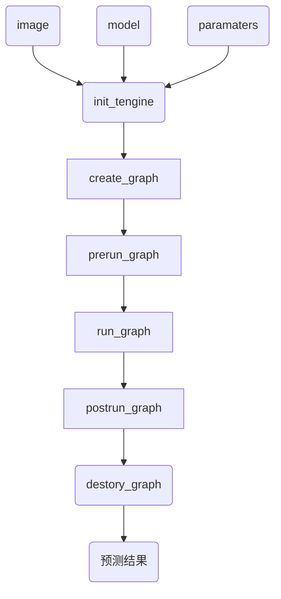

# Tengine 推理流程
依照顺序调用Tengine核心API如下：

## 1. <font color=blue>init_tengine</font>

初始化Tengine，该函数在程序中只要调用一次即可。

## 2. <font color=blue>create_graph</font>

创建Tengine计算图。

## 3. <font color=blue>prerun_graph</font>

预运行，准备计算图推理所需资源。设置大小核，核个数、核亲和性、数据精度都在这里。

```c
struct options
{
  int num_thread;//核个数设置，
  int cluster;//大小核设置，可选TENGINE_CLUSTER_[ALL,BIG，MEDIUM，LITTLE]
  int precision;//精度设置，TENGINE_MODE_[FP32,FP16,HYBRID_INT8,UINT8,INT8]
  uint64_t affinity;//核亲和性掩码，绑定具体核，
};
```


## 4. <font color=blue>run_graph</font>

启动Tengine计算图推理。

## 5. <font color=blue>postrun_graph</font>

停止运行graph，并释放graph占据的资源。

## 6. <font color=blue>destroy_graph</font>

销毁graph。

postrun_graph和destroy_graph在执行完模型推理后调用，一般是连续调用。
使用markdown流程图mermaid表示如下：

>

>

| |
| ------------------------------------------------------------ |
| 图1 推理流程图                               |