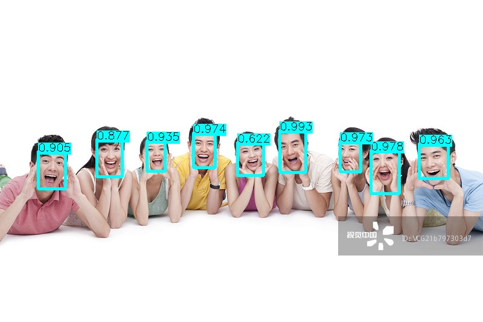

# YuFaceDetectNet With Tengine

[](./LICENSE)

## YuFaceDetectNet
This is `YuFaceDetectNet`(https://github.com/ShiqiYu/libfacedetection) implementation with [Tengine](https://github.com/OAID/Tengine).





## Download YuFaceDetectNet models

You can download model from *Tengine Model Zoo*, or from ShiqiYu github (which need to upgrade the model).

### **Download form Tengine model zoo**
You can directly download the upgrated caffemodel in [Tengine model zoo](https://pan.baidu.com/s/1LXZ8vOdyOo50IXS0CUPp8g) (psw: 57vb) in the directory `Tengine_models/yufacedetect`.


- yufacedetectnet-open-v1_new.prototxt
- yufacedetectnet-open-v1_new.caffemodel

### **Download from ShiqiYu-Github**
You can also download the caffemodel from https://github.com/ShiqiYu/libfacedetection

`NOTE`: the Caffe model has to be upgraded using:
- *Caffe/build/tools/upgrade_net_proto_text*
- *Caffe/build/tools/upgrade_net_proto_binary*
  
Or you change input part of prototxt from
```
input: "data"

input_shape {
dim: 1
dim: 3
dim: 240
dim: 320
}
```
to
 
```
layer {
name: "input"
type: "Input"
top: "data"
input_param {
    shape {
    dim: 1
    dim: 3
    dim: 240
    dim: 320
    }
  }
}
```

## Build examples

```bash
# build tengine
cd  ${Tengine_ROOT}
make
make install

# build example
cd example/YuFaceDetectNet
mkdir build
cd build
cmake -DTENGINE_DIR=/home/firefly/Tengine ..
make
```
* DTENGINE_DIR is your Tengine-dir (should be absolute path)
## Run
* threshold set to `0.5` in [yu_facedetect.cpp/line33](yu_facedetect.cpp#L33)
* image resize to `320x240` in [yu_facedetect.cpp/line134-line140](yu_facedetect.cpp#L134-L140)
```bash
# YuFaceDetect <proto> <caffemodel> <jpg>
YuFaceDetect \
    yufacedetectnet-open-v1_new.prototxt \
    yufacedetectnet-open-v1_new.caffemodel \
    demo.jpg
```

## Results
The default output image is saved as `save.jpg`.
    
It shows detected class and its confidence score.

```
--------------------------------------------
Face id: prob%  BOX:( x0 , y0 ),( x1 , y1 )
--------------------------------------------
Face 1: 99%     BOX:( 463.715 , 215.436 ),( 508.419 , 287.153 )
Face 2: 98%     BOX:( 614.291 , 248.478 ),( 662.452 , 322.064 )
Face 3: 97%     BOX:( 320.66 , 219.341 ),( 357.723 , 279.233 )
Face 4: 97%     BOX:( 563.467 , 233.703 ),( 599.201 , 286.063 )
Face 5: 96%     BOX:( 694.748 , 237.08 ),( 744.06 , 297.016 )
Face 6: 93%     BOX:( 243.901 , 232.61 ),( 275.517 , 284.73 )
Face 7: 90%     BOX:( 63.5015 , 250.778 ),( 109.698 , 313.893 )
Face 8: 88%     BOX:( 160.599 , 230.152 ),( 204.356 , 293.171 )
Face 9: 62%     BOX:( 393.385 , 235.289 ),( 437.595 , 291.87 )
detect faces : 9
======================================
[DETECTED IMAGE SAVED]: save.jpg
======================================
```

