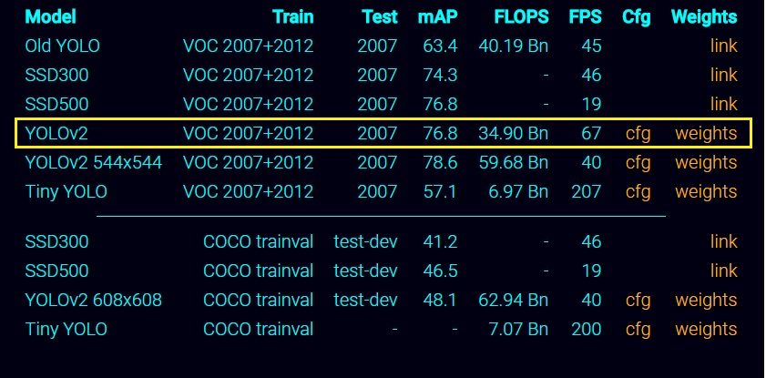
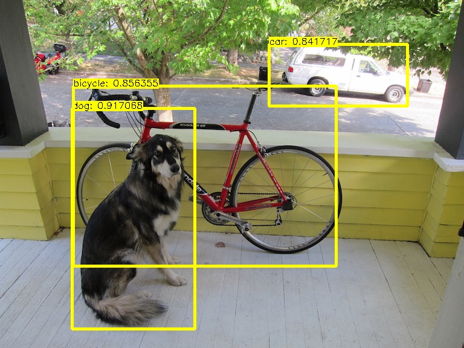

# Yolov2 implementation with Tengine

[](./LICENSE)

This is [yolov2](https://pjreddie.com/darknet/yolov2/) implementation with [Tengine](https://github.com/OAID/Tengine).




## Download required models
Download the models from [Tengine model zoo](https://pan.baidu.com/s/1LXZ8vOdyOo50IXS0CUPp8g) (psw: 57vb).

Store these files into `${Tengine_ROOT}/models/`
- yolo-voc.prototxt
- yolo-voc.caffemodel

This caffemodel is converted from origin darknet model [yolov2-voc.cfg](https://github.com/pjreddie/darknet/blob/master/cfg/yolov2-voc.cfg), [yolov2-voc.weight](https://pjreddie.com/media/files/yolov2-voc.weights)


## Parameters
By default, the detected objects display with a confidence threshold of 0.24. You can change this threshold in code [yolov2.cpp](yolov2.cpp).
```
float thresh=0.24;
```

## Build examples
```
cd  ${Tengine_ROOT}
make
make install

```
build as ${TENGINE_ROOT}/examples/readme.md

## Run

1. run yolov2 by default
    - model files are `tengine/models/yolo-voc.prototxt` and `tengine/models/yolo-voc.caffemodel`
    - test image is `tengine/tests/images/ssd_dog.jpg`
    ```
    cd  ${Tengine_ROOT}/examples/build/yolov2
    ./YOLOV2
    ```

2. run yolov2 with other models and image
    ```
    cd  ${Tengine_ROOT}/examples/build/yolov2
    ./YOLOV2 -p proto_file -m model_file -i image_file
    ```

3. show result

    Using default input image, the output image is saved as `save.jpg`.
    
    It shows detected class and its confidence score.
    
    

